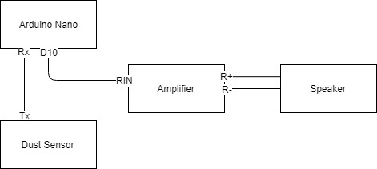

# Fine Dust Counter

The fine dust counter is very similar to a geiger counter because it's "displaying" the dust concentration with the typical geiger counter clicking. 
**The projects aim is to raise awareness for the danger of fine dust.**

## Wiring

## Parts

-  Nova PM Sensor SDS011
- 3,8 cm 4 Ohm 3 W Full Range Audio Speaker
- mini 2x3Watt Audio Stereo Verstärker PAM8403 

